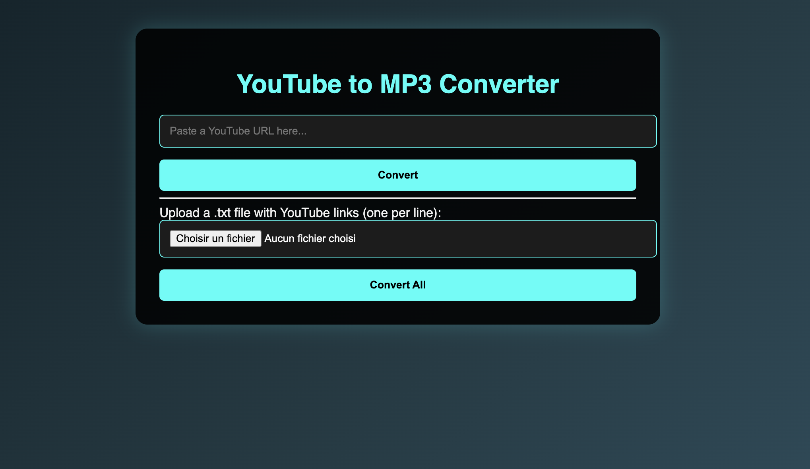

# YouTube Audio Converter API

A clean, modular Flask-based backend for downloading and serving YouTube audio tracks as MP3 files.

Forked and adapted from the project by **Jaime00Marulanda**.



---

## Features

- **Download YouTube audio** and convert it to high-quality MP3.
- **Token-based access management** for downloading files securely.
- **Automatic token expiration** and cleanup handled in the background.
- **Web UI** for easier interaction (available at `/ui`).

---

## Technologies Used

- [Flask](https://flask.palletsprojects.com/)
- [yt-dlp](https://github.com/yt-dlp/yt-dlp)
- [FFmpeg](https://ffmpeg.org/)
- Python 3.7+

---

## Project Structure

```
.
├── main.py              # Flask application entry point
├── access_manager.py    # Manages tokens and file access
├── constants.py         # Constants for error codes and settings
├── templates/
│   └── index.html  # Web UI template
├── static/              # Static files (CSS, JS, images)
└── downloads/         # Folder for downloaded MP3 files
```

---

## API Endpoints

### `GET /`

Download and convert YouTube video audio to MP3.

**Query Parameters:**

- `url` (str): Full YouTube video URL.

**Response:**

```json
{
  "token": "<download_token>"
}
```

### `GET /download`

Download the MP3 file using a valid token.

**Query Parameters:**

- `token` (str): Unique access token received after conversion.

**Response:**

- MP3 file download or error JSON if token is invalid/expired.

### `GET /ui`

Access a simple HTML interface to input YouTube links and download audio.

---

## Setup & Run

1. **Clone the repository**

```bash
git clone <your-repo-url>
cd <your-project-directory>
```

2. **Install dependencies**

```bash
pip install -r requirements.txt
```

3. **Install FFmpeg**

- Linux (Debian/Ubuntu):
  ```bash
  sudo apt update && sudo apt install ffmpeg
  ```
- macOS (using brew):
  ```bash
  brew install ffmpeg
  ```
- Windows: [Download FFmpeg binaries](https://ffmpeg.org/download.html)

4. **Run the server**

```bash
python main.py
```

The app will be available at `http://127.0.0.1:5000/`.

---

## Notes

- Tokens are time-limited to ensure secure temporary access.
- Filenames are sanitized to avoid filesystem issues.
- Remember to create the `downloads/` folder or adjust the path in `constants.py`.

---

## License

This project is adapted and licensed under the [MIT License](LICENSE).

---

## Credits

- Original base by [Alperen Sümeroğlu](https://github.com/Jaime00Marulanda)
- Adaptation and improvements by Luciole Labs.
